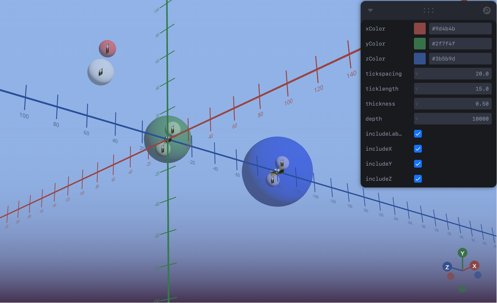

This is a customizable 3D Cartesian Axis coordinate system for 
[@react-three/fiber](https://github.com/pmndrs/react-three-fiber).

Watch the [intro video!](https://youtu.be/B3nWiw0P72Q?si=KtznylJ-uXBlYEug)



## Installation
No special installation instructions; place the component (one file) into your directory structure (ex. the 'components' directory), import, and it should be ready to go. ou can use
```bash
npm install
```
to update the dependencies if needed. The only real dependency besides the obvious is 
[drei](https://github.com/pmndrs/react-three-fiber](https://github.com/pmndrs/drei).

Download the [sample project](https://github.com/quayjn/r3f-cartesian-axes/tree/main/demo) 
to see it in a working React Three Fiber app, working nicely with [leva's user controls](https://github.com/pmndrs/leva).
You should just be able to copy the whole directory structure and then use ```npm install``` to get it going.

## Basic usage
```jsx
import CartesianAxes from 'components/R3FCoordinateAxes'

<Canvas>
  <CartesianAxes />
</Canvas>
```
or
```
const axesConfig = {
    param1: "param-value"
    ...
    paramx: "param-value"
  });
<Canvas>
  <CartesianAxes {...axesConfig} />
</Canvas>
```

## Parameters
| Parameter        | Type        | Default Value | Description                                                      |
|------------------|-------------|---------------|------------------------------------------------------------------|
| `includeX`       | `boolean`   | `true`        | Show the x-axis.                                                 |
| `includeY`       | `boolean`   | `true`        | Show the y-axis.                                                 |
| `includeZ`       | `boolean`   | `false`       | Show the z-axis.                                                 |
| `xColor`         | `hexstring` | `#9d4b4b`     | The color of the x-axis.                                         |
| `yColor`         | `hexstring` | `#2f7f4f`     | The color of the y-axis.                                         |
| `zColor`         | `hexstring` | `#3b5b9d`     | The color of the z-axis.                                         |
| `thickness`      | `number`    | `1`           | Thickness of the axes. Gets weird at larger values.              |
| `depth`          | `number`    | `2000`        | How far the axes go. Actual results depend on camera settings.   |
| `tickspacing`    | `number`    | `20`          | Spacing for the ticks. Zero means no ticks.                      |
| `ticklength`     | `number`    | `15`          | Length of the ticks.                                             |
| `includeLabels`  | `boolean`   | `true`        | Whether to include text for the numeric coordinate of each tick. |

## Some notes
* Avoid setting the 'depth' value too high. It could crash things.
* Set "tickspacing" to "0" to remove ticks. Or set "ticklength" to 0.
* You may see some buggy behavior if you use transparent meshes.
</ul>

## Future Features
* Include [leva user controls](https://github.com/pmndrs/leva) or something similar as a default inclusion in the install
* Allow for new instances of the axes to be created at any point in 3D space
* Include a toggle to hide the controls. Altho, you can now just toggle off each axis.

## Links
* Intro video: [https://youtu.be/B3nWiw0P72Q?si=KtznylJ-uXBlYEug](https://youtu.be/B3nWiw0P72Q?si=KtznylJ-uXBlYEug)
* Webpage: [https://quayjn.github.io/r3f-cartesian-axes/](https://quayjn.github.io/r3f-cartesian-axes/)
* CodeSandbox: [https://codesandbox.io/p/devbox/amazing-mcclintock-pflcjm](https://codesandbox.io/p/devbox/amazing-mcclintock-pflcjm)
* Demo: [https://pflcjm-5173.csb.app/](https://pflcjm-5173.csb.app/)
  
